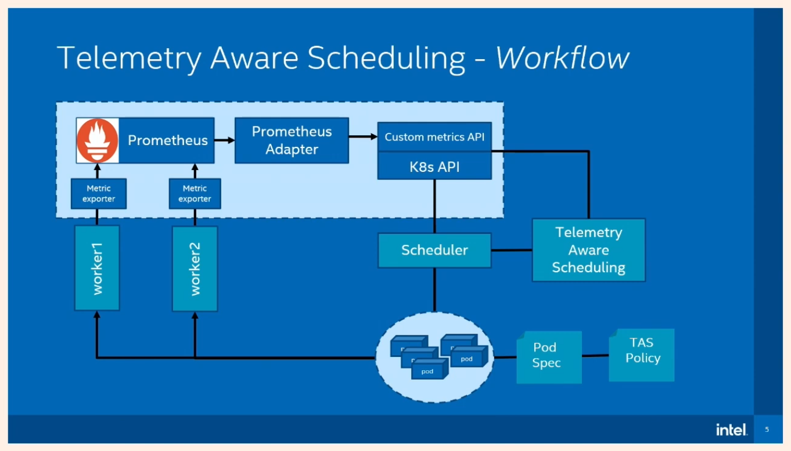

Create the cluster and configure the scheduler, install the custom metrics pipeline(prometheus, adapter, node exporter),
as described in the [walk through](intel-scheduler-walkthrough.md), but remember to change:

- Set the metrics (manually or by the service) but the name should be node_cpu_diff, value should be a float number
  between 0~100, indicating the usage in percentage

- using the provided custom-metrics-config-map because we add a formula to calculate the difference between the desired
  CPU usage and the current usage:

  ```Yaml
  - seriesQuery: '{__name__="node_cpu_diff"}'
    resources:
      overrides:
        instance:
          resource: node
    name:
      matches: ^node_cpu_(.*)
    metricsQuery: node_cpu_diff - 100 + 100 * avg by (instance, job) (rate(node_cpu_seconds_total{mode="idle"}[1m]))
  ```

  ​

- using the provided policy and the provided [deployment](cpu-diff-demo/cpu-deployment.yaml)
  /[cronjob](cpu-diff-demo/25-cpu-stress-test-cron.yaml) to deploy dummy workloads

## Troubleshooting



Checklist:

- [ ] Is kube-scheduler aware of the extender (see `postKubeadmCommands` configuration)? Are all ConfigMaps and TLS
  certificates correctly configured? 
- [ ] The custom metrics API server is running correctly?
- [ ] Is the telemetry aware scheduler pod running correctly?
- [ ] Is Prometheus deployed? Scraping the necessary metrics?
- [ ] If using built-in metrics from node exporter, is it running on the nodes?
- [ ] Is the TASPolicy resource correctly configured