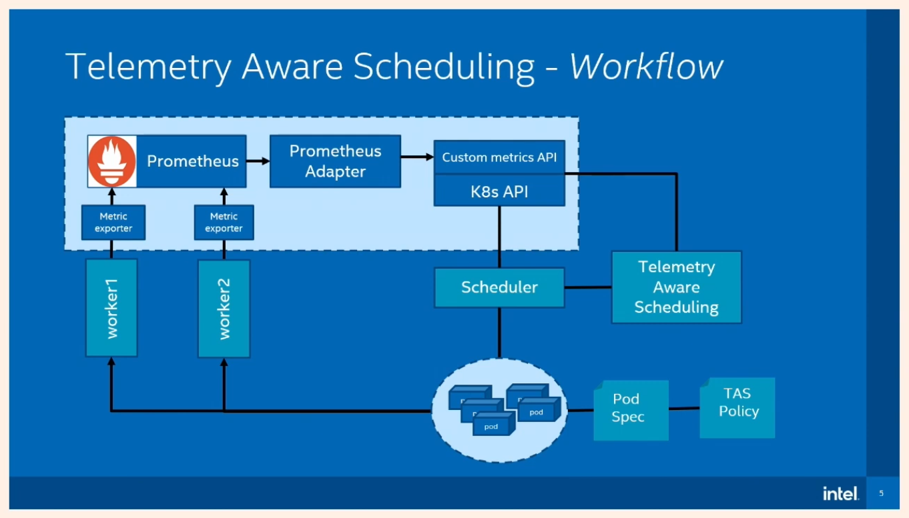

### Prerequisites

You need an image on GCP, at least v1.22.

Set the following environment variables:

```bash
export CLUSTER_NAME="scheduling-dev"
export GCP_PROJECT="k8s-ecoqube-development"
# Make sure to use same kubernetes version here as building the GCE image
export KUBERNETES_VERSION=1.22.9
export GCP_CONTROL_PLANE_MACHINE_TYPE=n1-standard-2
export GCP_NODE_MACHINE_TYPE=n1-standard-2
export GCP_NETWORK_NAME=default
export GCP_PROJECT_ID="k8s-ecoqube-development"
export GOOGLE_APPLICATION_CREDENTIALS="/home/criscola/IdeaProjects/helio/k8s-ecoqube-development-668c8628bd09.json"
```

Clone the repository

```bash
git clone https://github.com/kubernetes-sigs/image-builder.git image-builder
```

Use the Docker image present under `images/capi`:

```bash
cd image-builder/images/capi
docker build -t image-builder .
docker run -it --entrypoint /bin/bash image-builder
```

You can modify the build configuration by modifying the file under `images/capi/packer/gce`, for example if you are
building an ubuntu 2004 image, modify file `ubuntu-2004.json`, e.g.

```json
{
  "build_name": "ubuntu-2004",
  "distribution_release": "focal",
  "distribution_version": "2004",
  "zone": "europe-west6",
  "kubernetes_deb_version": "1.25.0-00",
  "kubernetes_rpm_version": "1.25.0-0",
  "kubernetes_semver": "v1.25.0",
  "kubernetes_series": "v1.25"
}
```

you can find the full list of variables [here](https://image-builder.sigs.k8s.io/capi/capi.html#customization).

For the rest of the guide, you can follow
the [documentation](https://github.com/kubernetes-sigs/cluster-api-provider-gcp/blob/main/docs/book/src/topics/prerequisites.md).

### Setting up Cluster API on GCP

From https://cluster-api.sigs.k8s.io/user/quick-start.html

Environment variables to set

```bash
export GCP_REGION="europe-west6"
export GCP_PROJECT="k8s-ecoqube-development"
# Make sure to use same Kubernetes version here as the previously built GCE image
export KUBERNETES_VERSION=1.25.0
export GCP_CONTROL_PLANE_MACHINE_TYPE=n1-standard-2
export GCP_NODE_MACHINE_TYPE=n1-standard-2
export GCP_NETWORK_NAME=default
export CLUSTER_NAME="scheduling-dev-mgmt"
export GOOGLE_APPLICATION_CREDENTIALS="/home/criscola/IdeaProjects/helio/k8s-ecoqube-development-668c8628bd09.json"
export GCP_PROJECT_ID="k8s-ecoqube-development"
export GCP_PROJECT="k8s-ecoqube-development"
export GCP_B64ENCODED_CREDENTIALS=$( cat /home/criscola/IdeaProjects/helio/k8s-ecoqube-development-668c8628bd09.json | base64 | tr -d '\n' )
export IMAGE_ID=projects/k8s-ecoqube-development/global/images/cluster-api-ubuntu-2004-v1-25-0-1662644962

# Enable ClusterResourceSet experimental feature
export EXP_CLUSTER_RESOURCE_SET=true
```

Init local temporary bootstrap cluster

```
kind create cluster --config bootstrap-kind-config-gcp.yaml
kubectl cluster-info
```

Provision temporary management cluster

```
clusterctl init --infrastructure gcp
```

Generate Cluster API config (only for documentation purposes, see below note)

> Note: the definitions are already created and present in a single file `scheduling-dev-mgmt.yaml`, please use this one
> instead of generating the resources yourself.

```bash
clusterctl generate cluster scheduling-dev-mgmt \
  --kubernetes-version v1.21.10 \
  --control-plane-machine-count=1 \
  --worker-machine-count=1 \
  > scheduling-dev-mgmt.yaml
```

Next, add Calico's ConfigMap and the relative ClusterResourceSet resource to install the CNI automatically.

Apply config

```
kubectl apply -f scheduling-dev-mgmt.yaml
```

Wait until the control plane is up and running using the following command:

```watch -n 1 kubectl get kubeadmcontrolplane```, then get kubeconfig:

Note that both INITIALIZED API SERVER and API SERVER AVAILABLE must be true. Wait up to 10 minutes. Check also that worker nodes
are running on GCP through `kubectl --kubeconfig=./scheduling-dev-mgmt.kubeconfig get nodes`.

Next, get the cluster's kubeconfig:

```
clusterctl get kubeconfig scheduling-dev-mgmt > scheduling-dev-mgmt.kubeconfig
```

#### Deploy management cluster on GCP (production setup)

To deploy the management cluster on GCP as well (production setup), it is necessary to:

1. Rerun the cluster initialization with the GCP provider **in the newly created cluster**.
3. Move the resources with `clusterctl move` (see also
   https://cluster-api.sigs.k8s.io/clusterctl/commands/move.html) from the temporary bootstrap/management cluster to the
   newly created cluster. This will
   **promote it to management cluster**.
4. Decommission the temporary bootstrap/management cluster.
5. Set the kubeconfig to point to the promoted management cluster.
6. Create workload clusters as desired.

Here are the steps:

Make sure your selected kubeconfig is the one of the **bootstrap** cluster (should be `kind-kind` and already selected).
Note this can be a bit confusing: at this time, the cluster is named scheduling-dev-**mgmt** but until we run the
`clusterctl init` command, it's still technically a workload cluster (where the management one is our local `kind`
cluster). To promote the workload cluster on GCP to a management cluster and get rid of the local `kind` cluster, see
the following:

Prepare the cluster to become a management cluster by running:

```
clusterctl init --kubeconfig=$(pwd)/scheduling-dev-mgmt.kubeconfig --infrastructure gcp
```

Move the management cluster to the newly created cluster on GCP (workload cluster will become the management cluster):

```
clusterctl move --to-kubeconfig=./scheduling-dev-mgmt.kubeconfig 
```

You should see something like this:

```
Performing move...
Discovering Cluster API objects
Moving Cluster API objects Clusters=1
Moving Cluster API objects ClusterClasses=0
Creating objects in the target cluster
Deleting objects from the source cluster
```

Decommission the temporary cluster and select new config:

```
kind delete cluster
export KUBECONFIG=$(pwd)/scheduling-dev-mgmt.kubeconfig
```

Create a workload cluster:

> Note: the definitions are already created and present in a single file `scheduling-dev-wkld.yaml`, please use this one
> instead of generating the config yourself.

```
clusterctl generate cluster scheduling-dev-wkld \
  --kubernetes-version v1.21.10 \
  --control-plane-machine-count=1 \
  --worker-machine-count=3 \
  > scheduling-dev-wkld.yaml
```

then follow [this guide](capi-resource-set/cluster-automate.md) to create the config related to the ClusterResourceSets
and automatically provision CNI and Scheduler at cluster initialization.

Finally, apply the config:

```
kubectl apply -f scheduling-dev-wkld.yaml
```

Allow up to 10 minutes to wait for INITIALIZED and API SERVER AVAILABLE to become true, as explained
before (```watch -n 1 kubectl get kubeadmcontrolplane```). Afterwards, generate kubeconfig:

```
clusterctl get kubeconfig scheduling-dev-wkld > scheduling-dev-wkld.kubeconfig
```

Check that the two control planes are up and running

```
kubectl get kubeadmcontrolplane
```

You can merge the two kubeconfigs for convenience when using tools like `kubie` or `kubectx`

```
KUBECONFIG=./scheduling-dev-mgmt.kubeconfig:scheduling-dev-wkld.kubeconfig kubectl config view --flatten > scheduling-dev.kubeconfig
export KUBECONFIG=$(pwd)/scheduling-dev.kubeconfig
```

### Setting up the custom metrics pipeline

> Note: would be good to automate this by having CAPI install ArgoCD and let it automatically
> provision all the ZHM services and metric endpoints by syncing to a preconfigured repository.

> Note: the scheduler is already configured together with the scraping config for the target-exporter
> service and the formula to

Install the target-exporter service, see [repo](https://git.helio.dev/eco-qube/target-exporter).

Install the TASPolicy manifest. You can inspect its controller's logs to see what's going
on: `kubectl logs -n default telemetry-aware-scheduling-[..]`.

## Troubleshooting



Checklist:

- [ ] Is kube-scheduler aware of the extender (see `postKubeadmCommands` configuration)? Are all ConfigMaps and TLS
  certificates correctly configured?
- [ ] Is kube-scheduler able to list/get/watch all the necessary resources like ConfigMaps?
- [ ] The custom metrics API server is running correctly?
- [ ] Are the custom metrics available on each node (try
  with `kubectl get --raw /apis/custom.metrics.k8s.io/v1beta1/nodes/...`)?
- [ ] Is the telemetry aware scheduler pod running correctly?
- [ ] If using metrics from node exporter, is it running on the nodes? Prometheus is scraping those correctly?
- [ ] Is Prometheus correctly deployed? Scraping the necessary metrics?
- [ ] Is the Prometheus adapter correctly configured (resource overrides? name matches? metricsQuery?)?
- [ ] Is the TASPolicy resource correctly configured?
- [ ] Is the Pod correctly configured (policy name in the labels? nodeAffinity? telemetry/scheduling: "1" in the limits
  field?)